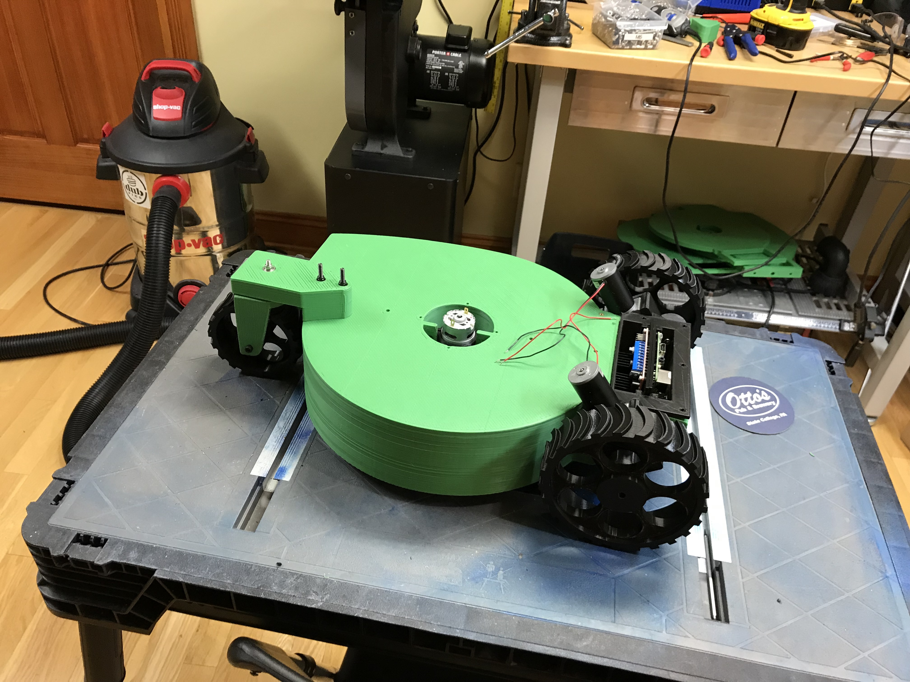
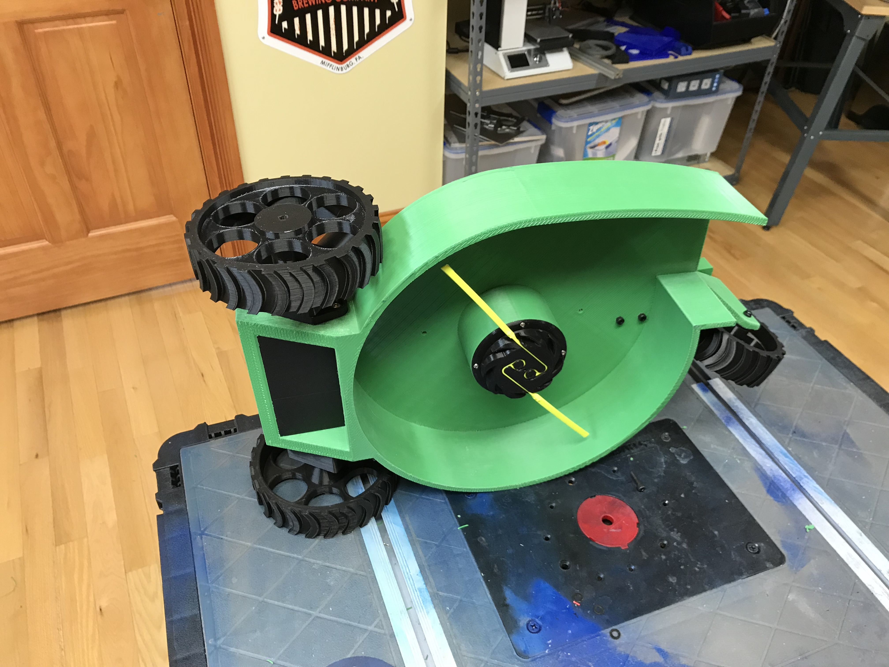

# Raspberry Pi powered 3d printed robot mower

This project (name pending) is a fairly adventurous one, my goal is to design, build, and program an entirely autonomous swarm capable robot mower platform.  
The platform will be powered by a Raspberry Pi 3 B+, and use easily purchasable components along with 3d printed parts, it is being designed as a reliable tool, not a gimicky toy.

I will be updating this repository as I progress. You can follow my progress on Twitter: https://twitter.com/dchote

